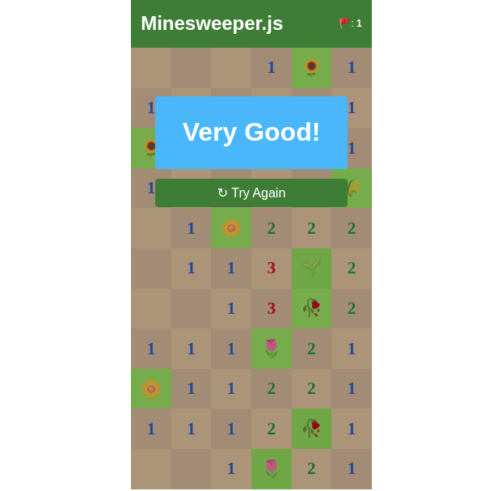

# 💣 Minesweeper.js

<div id="top" align="center">


**Um clássico jogo de Campo Minado desenvolvido com JavaScript moderno, utilizando Web Components customizados e o algoritmo DFS para revelar áreas seguras.**

[📸 Screenshot](#-demonstração) • [🚀 Quick Start](#-quick-start) • [📚 Documentação](#-documentação) • [🎓 Aprendizados](#-aprendizados) • [🤝 Contribuições](#-contribuições)

</div>

---

## 📖 Sobre o Projeto

Minesweeper.js é uma implementação completa do clássico jogo Campo Minado, desenvolvida com **JavaScript moderno e Web Components**. Este projeto foi criado com dois objetivos principais em mente:

1. **🎯 Aprendizado de Algoritmos**: Implementação e compreensão profunda do algoritmo **Depth-First Search (DFS)** para revelar automaticamente áreas seguras do tabuleiro
2. **🧩 Exploração de Web Components**: Utilização avançada de `customElements` do JavaScript para criar componentes reutilizáveis e encapsulados

---

## ✨ Características

- ✅ **Web Component Personalizado** - Componente `<minesweeper-game>` totalmente customizável
- ✅ **Algoritmo DFS** - Busca em profundidade para revelar áreas sem bombas
- ✅ **Configuração Flexível** - Defina altura, largura e quantidade de bombas
- ✅ **Sistema de Flags** 🚩 - Marque posições suspeitas
- ✅ **Interface Responsiva** - Design adaptável para diferentes tamanhos de tela
- ✅ **Modo Debug** - Exiba todas as bombas no console para testes
- ✅ **Game Over Inteligente** - Mensagens diferenciadas para vitória e derrota
- ✅ **Shadow DOM** - Encapsulamento de estilos usando Shadow DOM

---

## 🎮 Demonstração

<div style="display:flex; gap:10px; flex-wrap:wrap; justify-content:center;">
    <video autoplay loop muted playsinline width="300">
    <source src="./sample/pictures/video.mp4" type="video/mp4">
    Seu navegador não suporta vídeos HTML5.
    </video>
    
</div>

### Como Jogar

1. **Clique nos Quadrados** para revelar as células
2. **Clique Direito para Marcar** 🚩 campos suspeitos
3. **Revele Todos** os campos seguros para vencer
4. **Evite as Bombas** 💣 para não perder o jogo

---

## 🚀 Quick Start

### Requisitos
- 🌐 Navegador moderno com suporte a ES6 Modules
- 📝 Editor de código (recomendado: VS Code)

### Instalação

```bash
# Clone o repositório
git clone https://github.com/GustavoRutkowski/Minesweeper.js.git

# Entre no diretório
cd Minesweeper.js

# Abra o arquivo sample/index.html em seu navegador
# Você pode usar um servidor local, como o que é gerado pela Extensão Live Server
```

### Uso Rápido

```html
<!DOCTYPE html>
<html>
<head>
    <script src="src/js/minesweeper-game.js" type="module"></script>
</head>
<body>
    <!-- Crie um campo de Campo Minado 10x10 com 20 bombas -->
    <minesweeper-game 
        width="10" 
        height="10" 
        bombs="20"
        cheats="false">
    </minesweeper-game>
</body>
</html>
```

---

## 📚 Documentação

### Atributos do Componente

| Atributo | Tipo | Padrão | Descrição |
|----------|------|--------|-----------|
| `width` | number | 6 | Número de colunas do tabuleiro |
| `height` | number | 11 | Número de linhas do tabuleiro |
| `bombs` | number | 10 | Quantidade de bombas no jogo |
| `cheats` | boolean | false | Exibe as posições das bombas no console |

### Exemplos de Uso

#### Jogo Fácil (Iniciante)
```html
<minesweeper-game width="8" height="8" bombs="10"></minesweeper-game>
```

#### Jogo Médio (Intermediário)
```html
<minesweeper-game width="12" height="12" bombs="30"></minesweeper-game>
```

#### Jogo Difícil (Avançado)
```html
<minesweeper-game width="16" height="16" bombs="60"></minesweeper-game>
```

#### Modo Debug/Cheat
```html
<minesweeper-game width="10" height="10" bombs="20" cheats="true"></minesweeper-game>
```

---

## 🧠 Algoritmo DFS (Depth-First Search)

### O que é DFS?

**DFS (Busca em Profundidade)** é um algoritmo fundamental de travessia de grafos que explora tão longe quanto possível ao longo de cada ramo antes de retroceder.

### Como é Usado no Minesweeper?

Quando você clica em uma célula segura (sem bomba), o algoritmo DFS é ativado para:

1. **Explorar Adjacências**: Verifica os 8 quadrados vizinhos
2. **Contar Bombas Próximas**: Determina quantas bombas cercam aquela célula
3. **Revelar Recursivamente**: Se não houver bombas adjacentes, revela automaticamente todos os vizinhos seguros
4. **Parar Inteligentemente**: Para quando encontra células com bombas próximas

```
┌───┬───┬───┐
│ 1 │ 💣 │ 1 │
├───┼───┼───┤
│ 1 │ 0 │ 1 │  ← Célula com 0 bombas → DFS revela vizinhos
├───┼───┼───┤
│ 1 │ 💣 │ 1 │
└───┴───┴───┘
```

---

## 📁 Estrutura do Projeto


### Scripts Principais

| Arquivo | Propósito |
|---------|-----------|
| **minesweeper-game.js** | Web Component principal que orquestra todo o jogo |
| **gen-ms.js** | Contém o algoritmo DFS e geração da matriz do jogo |
| **check-square.js** | Lógica de revelação de células |
| **flags.js** | Marcação com flags de posições suspeitas |
| **game-over.js** | Gerencia estados de vitória e derrota |
| **gen-css.js** | Geração dinâmica de estilos CSS |

---

## 🎓 Aprendizados

Este projeto foi desenvolvido para explorar e dominar:

* ### **Algoritmo DFS (Depth-First Search)** 🎯
- Implementação recursiva de busca em profundidade
- Aplicação prática em um contexto de jogo
- Otimização de performance em estruturas bidimensionais
- Tratamento de casos especiais (bordas, células adjacentes)

* ### **Web Components & Custom Elements** 🧩
- Criação de componentes customizados reutilizáveis
- Uso de Shadow DOM para encapsulamento
- Importação de módulos ES6
- Lifecycle hooks (`constructor`, `connectedCallback`, etc.)
- Atributos customizados e sua validação

---

## 🔧 Tecnologias Utilizadas

```
┌─────────────────────────┐
│   Technologies Stack    │
├─────────────────────────┤
│ ✨ JavaScript ES6+      │
│ 🧩 Web Components       │
│ 🔒 Shadow DOM           │
│ 📦 ES6 Modules          │
│ 🎨 CSS3 Dinâmico        │
│ 🌐 HTML5                │
└─────────────────────────┘
```

---

## 🐛 Melhorias Planejadas
- 🔄 Adicionar Cronometro e armazenar recorde do usuário
- 🎵 Efeitos sonoros e feedback visual
- 📱 Suporte completo para touch (mobile)
- ♿ Melhorias de acessibilidade (ARIA labels)
- 🌙 Temas customizáveis para o componentes

---

## 📝 Como Contribuir

1. **Fork** o projeto
2. Crie uma branch para sua feature (`git checkout -b feature/AmazingFeature`)
3. Commit suas mudanças (`git commit -m 'Add some AmazingFeature'`)
4. Push para a branch (`git push origin feature/AmazingFeature`)
5. Abra um **Pull Request**

### Diretrizes
- ✅ Mantenha o código limpo e bem documentado
- ✅ Adicione comentários explicativos para lógica complexa
- ✅ Teste suas mudanças antes de fazer PR
- ✅ Respeite a estrutura modular existente

---

<div align="center">

### ⭐ Se este projeto foi útil, considere dar uma estrela!

**Desenvolvido com ❤️ e ☕**


[⬆ Voltar ao Topo](#top)

</div>
